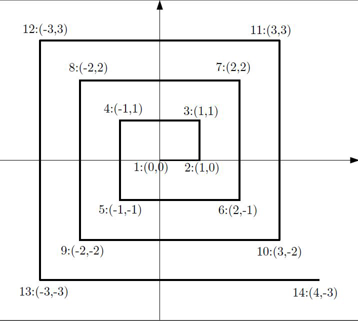

# مسئله: حلزون مختصاتی

**محدودیت زمان:** ۱ ثانیه  
**محدودیت حافظه:** ۶۴ مگابایت  


شکل زیر، یک **حلزون مختصاتی** را نشان می‌دهد.  
هر حلزون مختصاتی با اندازه‌ی `n` از شماره‌ی **۱** در مرکز مختصات شروع می‌شود و طبق تصویر زیر مسیر خود را ادامه می‌دهد.

می‌خواهیم برنامه‌ای بنویسیم که عدد `n` را از کاربر دریافت کرده و **مختصات نقطه‌ی متناظر با آن عدد** را محاسبه و چاپ کند.



---

## ورودی  

در یک خط، عدد `n` به شما داده می‌شود.  

```

1 ≤ n ≤ 10^6

```

---

## خروجی  

در تنها خط خروجی، مختصات نقطه‌ی مربوط به عدد `n` را چاپ کنید.  
مختصات باید با یک **فاصله** از هم جدا شوند.

---

## مثال  

### ورودی نمونه ۱
```

14

```

### خروجی نمونه ۱
```

4 -3

```

**توضیح:**  
شماره‌ی ۱ در مبدأ مختصات `(0, 0)` قرار دارد،  
شماره‌ی ۲ در نقطه‌ی `(1, 0)`  
و شماره‌ی ۳ در نقطه‌ی `(1, 1)`  
و به همین ترتیب مسیر ادامه می‌یابد تا در نهایت نقطه‌ی ۱۴ در مختصات `(-3, 4)` قرار گیرد.
```